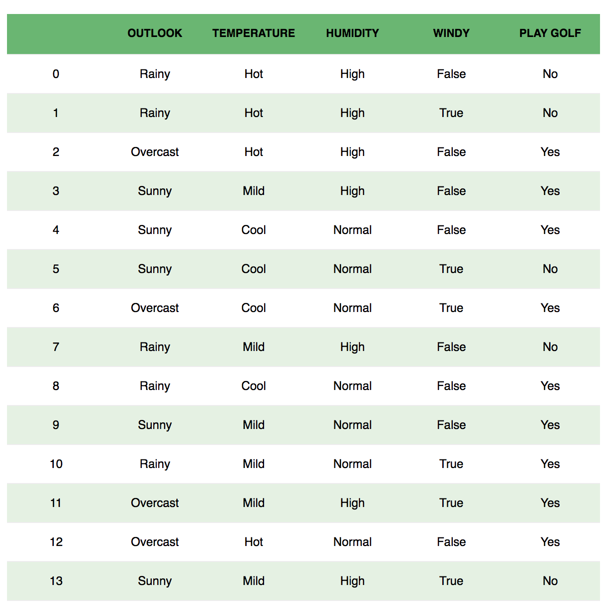

# 朴素贝叶斯

- 有监督学习
- 分类问题

## 首先让我们回忆一下概率中的基本公式：

条件概率：
$$
P(A|B)=\frac{P(A,B)}{P(B)}
$$

$$
P(B|A)=\frac{P(B,A)}{P(A)}
$$

乘法公式：
$$
P(A,B)=P(B,A)=P(A|B)P(B)=P(B|A)P(A)
$$
条件概率的链式法则：
$$
P(A,B,C)=P(A|B,C)P(B|C)P(C)
$$


## 什么是朴素贝叶斯法呢？

朴素贝叶斯 $(naive\space Bayes)$是基于贝叶斯定理与特征条件独立假设的分类方法


通过训练数据集学习联合概率分布$P(X,Y)$ 

具体地，学习**先验概率分布**以及**条件概率分布**


##### 先验概率分布：

$$
P(Y=c_k),k=1,2,...K
$$

##### 条件概率分布：

$$
P(X=x|Y=c_k)=P(X^{(1)}=x^{(1)},...,X^{(n)}=x^{(n)}|Y=c_k)
$$


于是我们就可以学习到联合概率分布$P(X,Y)$

朴素贝叶斯对条件概率作了条件概率独立性的假设，具体地，条件独立性假设是：


$$
\begin{equation}
\begin{split}
P(X=x|Y=c_k)&=P(X^{(1)}=x^{(1)},...,X^{(n)}=x^{(n)}|Y=c_k)\\
&=\varPi_{j=1}^{n}P(X^{(j)}=x^{(j)}|Y=c_k) \\
\end{split}
\end{equation}
$$


朴素贝叶斯分类时，对于给定输入$x$，通过学习后验概率分布$P(Y=c_k|X=x)$，将后验概率最大的类作为$x$的输出，即：
$$
P(Y=c_k|X=x)=\frac{P(X=x|Y=c_k)P(Y=c_k)}{\sum_{k}{P(X=x|Y=c_k)P(Y=c_k)}}
$$
将**条件概率分布**代入：
$$
P(Y=c_k|X=x)=\frac{\varPi_{j=1}^{n}P(X^{(j)}=x^{(j)}|Y=c_k)P(Y=c_k)}{\sum_{k}{\varPi_{j=1}^{n}P(X^{(j)}=x^{(j)}|Y=c_k)P(Y=c_k)}}
$$
因此我们可以把朴素贝叶斯分类起表示为：
$$
P(Y=c_k|X=x)=arg\space max_{c_k}\frac{\varPi_{j=1}^{n}P(X^{(j)}=x^{(j)}|Y=c_k)P(Y=c_k)}{\sum_{k}{\varPi_{j=1}^{n}P(X^{(j)}=x^{(j)}|Y=c_k)P(Y=c_k)}}
$$


注意，上式中分母对所有$c_k$都是相同的，所以：
$$
P(Y=c_k|X=x)=arg\space max_{c_k}\varPi_{j=1}P(X^{(j)}=x^{(j)}|Y=c_k)P(Y=c_k)
$$


概率的知识有点多～我们先用感性来认知！


## 举个例子～

考虑有关高尔夫的问题，数据集如图展示

|    单词     |     意思     |
| :---------: | :----------: |
|   OUTLOOK   |     户外     |
| TEMPERATURE |     温度     |
|  HUMIDITY   |     湿度     |
|    WINDY    |   是否多风   |
|  PLAY GOLF  | 是否打高尔夫 |





如果我们观察第一行，我们会发现户外(OUTLOOK)是阴雨天(Rainy)，并且温度(TEMPERATURE)和湿度(HUMIDITY)都很高，并且不是多风(WINDY)

我们大体上可以判断今天并不是一个适合打高尔夫的一天

我们做了两个假设：

- 假设1：我们认为特征之间是相互独立的，比如温度与湿度之间没有什么联系
- 假设2：我们认为特征对结果有着相同的影响，比如户外的情况并没有起着是否打高尔夫球的决定性作用


根据这个例子，我们可以将**贝叶斯定理**写成：
$$
P(y|X)=\frac{P(X|y)P(y)}{P(X)}
$$


变量$y$代表类值(在这里代指是否打高尔夫)


变量$X$代表特征值(在这里代表：户外情况/温度/湿度/是否多风)


$X$：$$X=(x_1,x_2,x_3,...,x_n)$$

在这里，$x_1,x_2,...,x_n$代表特征，在本例中$n=4$，$\{x_1,x_2,x_3,x_4\}$分别代表了{户外情况，温度，湿度，是否多风}

我们通过替换$X=\{x_1,x_2,...,x_n\}$可以得到：
$$
P(y|x_1,...,x_n)=\frac{P(x_1|y)P(x_2|y)...P(x_n|y)P(y)}{P(x_1)P(x_2)...P(x_n)}
$$
现在，我们可以通过查看数据集获取每个值并将它们代入方程式，上式中分母对于$y$都是相同的，因此：
$$
P(y|x_1,...,x_n)\propto P(y)\varPi_{i=1}^{n}P(x_{i}|y)
$$
在本例中，类值$y$只有两种输出$\{+1,-1\}$，即是/不是

但也存在多分类的情况，因此我们需要找到$y$的极大似然估计：
$$
y=argmax_yP(y)\varPi_{i=1}^{n}P(x_{i}|y)
$$


## Sklearn-naive bayes

#### 前提：假设你是一名医生，你手上拥有着以往糖尿病患者的数据信息。假如，此时新增一名患者，你需要判断他是否得了糖尿病。


以往的数据如下（只展示了前5行数据）：

| 葡萄糖含量 | 血压含量 | 是否得糖尿病 |
| :--------: | :------: | :----------: |
|     40     |    85    |      否      |
|     40     |    92    |      否      |
|     45     |    63    |      是      |
|     45     |    80    |      否      |
|     40     |    73    |      是      |


```python
# 导入相关库
import numpy as np
import pandas as pd
import matplotlib.pyplot as plt
from sklearn.model_selection import train_test_split
from sklearn.metrics import accuracy_score
from sklearn.naive_bayes import GaussianNB

%matplotlib inline
%config InlineBackend.figure_format = 'svg'

# 加载数据
data = pd.read_csv('./Naive-Bayes-Classification-Data.csv')

# 数据预处理
X,y=data.drop('diabetes',axis=1),data['diabetes']

X_train,X_test,y_train,y_test = train_test_split(X,y,test_size = 0.25,random_state=42)

# 可视化数据
##
# x轴代表葡萄糖含量
# y轴代表血压含量
# 绿色代表未患病/黑色代表患病
plt.figure(figsize = (6,4))
plt.tick_params(direction = 'in')
plt.scatter(data['glucose'],data['bloodpressure'],c = data['diabetes'])
plt.xlabel('glucose')
plt.ylabel('bloodpressure')
```

```python
# 定义模型
model = GaussianNB()
model.fit(X_train,y_train)

# 预测
y_pred = model.predict(X_test)
acc = accuracy_score(y_test,y_pred)*100
print(f'acc: {acc}')
:acc: 92.7710843373494
```


## 或则我们来看看如何用Python手写一个贝叶斯分类器！

1.引入需要的库

```python
import numpy as np
import pandas as pd
import matplotlib.pyplot as plt
from sklearn.datasets import load_iris
from sklearn.model_selection import train_test_split
from collections import Container

%matplotlib inline
%config InlineBackend.figure_format='svg'
```

2.定义我们的数据集

```python
# sklearn.datasets load_iris
# 一种由4个特征来辨别花的品种的数据集
def create_data():
    iris = load_iris()
    df = pd.DataFrame(iris.data,columns = iris.feature_names)
    df['label'] = iris.target
    df.columns = ['sepal length', 'sepal width', 'petal length', 'petal width', 'label']
    # 100 samples
    data = np.array(df.iloc[:100,:])
    # 4 features
    return data[:,:-1],data[:,-1]
```

3.预处理

```python
X,y = create_data()
X_train,X_test,y_train,y_test = train_test_split(X,y,test_size=0.3,random_state=123)
```

4.定义贝叶斯分类模型

数学期望：
$$
E(X)=\sum_{i=1}^{∞}x_ip_i
$$
方差：
$$
D(X)=\sum_i^{n}(x_i-EX)^2p_i
$$
高斯概率密度函数：
$$
P(x_i|y_i)=\frac{1}{\sqrt{2\pi\sigma^{2}_{yk}}}exp(-\frac{(x_i-u_{yk})^2}{2\sigma^2_{yk}})
$$


```python
class NaiveBayes:
    def __init__(self):
        self.model = None
        
    # 计算均值
    @staticmethod
    def mean(X):
        return sum(X)/float(len(X))
    
    # 计算标准差
    def stdev(self,X):
        avg = self.mean(X)
        return np.sqrt(sum([np.power(x-avg,2) for x in X])/float(len(X)))
    
    # 高斯概率密度函数
    def gaussian_probability(self,x,mean,stdev):
        exponent = np.exp(-(np.power(x-mean,2)/(2*np.power(stdev,2))))
        
        return (1/(np.sqrt(2*np.pi)*stdev))*exponent
    
    # 处理训练集X_train
    def summarize(self,train_data):
        summaries = [(self.mean(i),self.stdev(i)) for i in zip(*train_data)]
        return summaries
    
    # 分类别求出数学期望和标准差
    def fit(self,X,y):
        labels = list(set(y))
        data = {label:[] for label in labels}
        for f,label in zip(X,y):
            data[label].append(f)
            
        self.model = {
            label : self.summarize(value)
            for label,value in data.items()
        }
        
        return 'gaussianNB train done!'
    
    # 计算概率
    def calculate_probabilities(self,input_data):
        probabilities = {}
        for label,value in self.model.items():
            probabilities[label] = 1
            for i in range(len(value)):
                mean , stdev = value[i]
                probabilities[label] *= self.gaussian_probability(input_data[i],mean,stdev)
                
        return probabilities
    
    
    # 类别
    def predict(self,X_test):
        label = sorted(
            self.calculate_probabilities(X_test).items(),
            key = lambda x:x[-1])[-1][0]
        return label
    
    def score(self,X_test,y_test):
        right = 0
        for X,y in zip(X_test,y_test):
            label = self.predict(X)
            if label == y:
                right += 1
        return right/float(len(X_test))
```

5.训练并且测试参数

```python
clf = NaiveBayes()
clf.fit(X_train,y_train)
:'gaussianNB train done!'

print(clf.predict([4.4,  3.2,  1.3,  0.2]))
:0.0

clf.score(X_test,y_test)
:1.0
```


# [以上数据及源代码请点击这里]()

### 希望各位客官大人能够给我一个小小的star!​


### 参考：

- [统计学习方法]()
- [towards-data-science-naive-bayes](https://towardsdatascience.com/naive-bayes-classifier-81d512f50a7c)
- [heartbeat-naive-bayes](https://heartbeat.fritz.ai/naive-bayes-classifier-in-python-using-scikit-learn-13c4deb83bcf)

