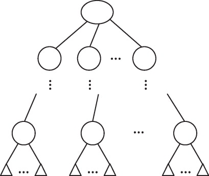
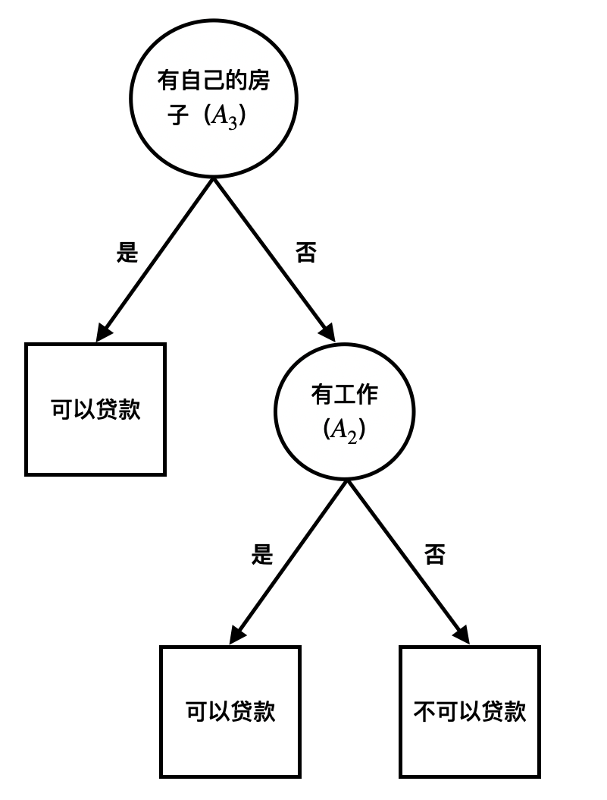

# 决策树

- 有监督学习
- 分类决策树

## 什么是决策树？

分类决策树模型是描述对实例进行分类的树形结构

决策树包括：

- 内部结点：表示特征
- 边：连接结点
- 叶结点：表示一个类

如图所示，图中圆和三角形分别代表内部结点和叶结点：

## 在进一步决策树的工作原理，我们先来了解一下几个概念

- #### 决策树与$if-then$规则：

  由决策树的根节点到叶结点的每一条路径构建一条**规则**

  路径上的内部结点对应着**规则**的条件，而叶结点对应着**规则**的结论

  每一个实例都被一条**规则**覆盖

- #### 熵$(entropy)$：

  熵是表示随机变量不确定性的度量，设$X$是一个取有限个值的离散随机变量，其概率分布为：
  $$
  P(X=x_i)=p_i,\space\space i=1,2,...n
  $$
  则随机变量$X$的熵的定义为（熵只依赖于$X$的分布，也将$X$的熵记作$H(p)$）：
  $$
  H(X)=H(p)=-\sum{}_{i=1}^np_{i}logp_i
  $$
  定义$0log0=0$

  熵越大，随机变量的不确定性就越大

- #### 条件熵$(conditional\space entropy)$：

  设随机变量$(X,Y)$，其联合概率分布为：
  $$
  P(X=x_i,Y=y_i)=p_{ij},\space\space i=1,2,...,n; \space\space j=1,2,...,m
  $$
  条件熵 $H(Y|X)$表示在已知随机变量$X$的条件下随机变量$Y$的不确定性；随机变量$X$的条件下随机变量$Y$条件熵，定义为$X$给定条件下$Y$的条件概率分布的熵对$X$的期望：
  $$
  H(Y|X)=\sum_{i=1}^{n}p_iH(Y|X=x_i)
  $$
  这里，$p_i=p(X=x_i),\space\space i=1,2,...,n$

- #### 信息增益$(information\space gain)$：

  概念：表示得知特征$X$的信息而使得类$Y$的信息不确定性的减少

  定义：特征$A$对训练数据集$D$的信息增益$g=(D,A)$，定义为集合$D$的经验熵$H(D)$与特征$A$给定条件下$D$的经验条件熵$H(D|A)$之差，即：
  $$
  g(D,A)=H(D)-H(D|A)
  $$

- 

- #### 特征选择

  概念：特征选择在于选取对训练数据具有分类能力的特征，通常特征选择的准则是**信息增益**或则**信息增益比**

## 我们通过一个例子来说明如何建立决策树

阅读下表，表由15个样本组成的贷款申请训练数据。数据包括申请人的4个特征：

##### 特征：

- 年龄			3			（青年，中年，老年）

- 工作			2			（是，否）

- 房子			2			（是，否）

- 信贷			2			（非常好，好，一般）

##### 标签：

- 贷款			2			（是，否）

|  ID  | 年龄 | 有工作 | 有自己的房子 | 信贷情况 | 贷款 |
| :--: | :--: | :----: | :----------: | :------: | :--: |
|  1   | 青年 |   否   |      否      |   一般   |  否  |
|  2   | 青年 |   否   |      否      |    好    |  否  |
|  3   | 青年 |   是   |      否      |    好    |  是  |
|  4   | 青年 |   是   |      是      |   一般   |  是  |
|  5   | 青年 |   否   |      否      |   一般   |  否  |
|  6   | 中年 |   否   |      否      |   一般   |  否  |
|  7   | 中年 |   否   |      否      |    好    |  否  |
|  8   | 中年 |   是   |      是      |    好    |  是  |
|  9   | 中年 |   否   |      是      |  非常好  |  是  |
|  10  | 中年 |   否   |      是      |  非常好  |  是  |
|  11  | 老年 |   否   |      是      |  非常好  |  是  |
|  12  | 老年 |   否   |      是      |    好    |  是  |
|  13  | 老年 |   是   |      否      |    好    |  是  |
|  14  | 老年 |   是   |      否      |  非常好  |  是  |
|  15  | 老年 |   否   |      否      |   一般   |  否  |

### $ID3$算法：

核心在于在决策树的每个结点利用信息增益值来选择特征，递归地构建决策树

### 1.计算信息增益值

样本数：15人

贷款人数：9人	非贷款人数：6人

#### 故计算经验熵$H(D)$：

$$
H(D)=-\frac{9}{15}log_2\frac{9}{15}-\frac{6}{15}log_2\frac{6}{15}=0.971
$$

#### 然后计算各个特征对数据集$D$的信息增益，以$A_1,A_2,A_3,A_4$代表年龄、工作、房子、信贷4个特征：

$A_1$：

年龄$(A_1)$共有：3种取值

青年$(D_1)$：5人	3人贷款	2人未贷款

中年$(D_2)$：5人	2人贷款	3人未贷款

老年$(D_3)$：5人	4人贷款	1人未贷款
$$
\begin{equation}
\begin{aligned}
g(D,A_1) & = H(D)-[\frac{5}{15}H(D_1)+\frac{5}{15}H(D_2)+\frac{5}{15}H(D_3)]\\
& = 0.971-[\frac{5}{15}(-\frac{2}{5}log_2\frac{2}{5}-\frac{3}{5}log_2\frac{3}{5})+\frac{5}{15}(-\frac{3}{5}log_2\frac{3}{5}-\frac{2}{5}log_2\frac{2}{5})+\frac{5}{15}(-\frac{4}{5}log_2\frac{4}{5}-\frac{1}{5}log_2\frac{1}{5})]\\
& = 0.971-0.888=0.083
\end{aligned}
\end{equation}
$$
$A_2$:

工作$(A_2)$共有：2种取值

有工作$(D_1)$：5人		5人贷款		0人未贷款

无工作$(D_2)$：10人		4人贷款		6人未贷款		
$$
\begin{equation}
\begin{aligned}
g(D,A_2) & = H(D)-[\frac{5}{15}H(D_1)+\frac{10}{15}H(D_2)]\\
& = 0.971-[\frac{5}{15}\times 0+\frac{10}{15}(-\frac{4}{10}log_2\frac{4}{10}-\frac{6}{10}log_2\frac{6}{10})]\\
& = 0.324
\end{aligned}
\end{equation}
$$
$A_3$：

有自己的房子$(A_3)$共有：2种取值

有房子$(D_1)$：6人		6人贷款		0人未贷款

无房子$(D_2)$：9人		3人贷款		6人未贷款
$$
\begin{equation}
\begin{aligned}
g(D,A_3) & = H(D)-[\frac{6}{15}H(D_1)+\frac{9}{15}H(D_2)]\\
& = 0.971-[\frac{6}{15}\times 0+\frac{9}{15}(-\frac{3}{9}log_2\frac{3}{9}-\frac{6}{9}log_2\frac{6}{9})]\\
& = 0.420
\end{aligned}
\end{equation}
$$
$A_4$：

信贷情况$(A_4)$：共有3种取值

一般：5人		1人贷款		4人未贷款

好：6人		4人贷款		2人未贷款

非常好：4人		4人贷款		0人未贷款
$$
\begin{equation}
\begin{aligned}
g(D,A_4) & = H(D)-[\frac{5}{15}H(D_1)+\frac{6}{15}H(D_2)+\frac{4}{15}H(D_3)]\\
& = 0.971-[\frac{5}{15}(-\frac{1}{5}log_2\frac{1}{5}-\frac{4}{5}log_2\frac{4}{5})+\frac{6}{15}(-\frac{4}{6}log_2\frac{4}{6}-\frac{2}{6}log_2\frac{2}{6})+\frac{4}{15}\times 0]\\
& = 0.363
\end{aligned}
\end{equation}
$$

最后，我们比较信息增益值。由于$A_3$的信息增益值最大，所以选择特征$A_3$作为最优特征，即是否有自己的房子

### 2.递归构建决策树

我们利用$ID3$算法来生成一颗决策树

由于特征$A_3$的信息增益值最大，所以选择特征$A_3$作为根结点的特征。它将训练数据集$D$划分为两个子集$D_1$（$A_3$取值为“是”）和$D_2$（$A_3$取值为“否”）

注：由于$D_1$只有同一类的样本，故成为叶结点，结点的类型标记为“是”

$D_1$：

|  ID  | 年龄 | 有工作 | 有自己的房子 | 信贷情况 | 贷款 |
| :--: | :--: | :----: | :----------: | :------: | :--: |
|  4   | 青年 |   是   |      是      |   一般   |  是  |
|  8   | 中年 |   是   |      是      |    好    |  是  |
|  9   | 中年 |   否   |      是      |  非常好  |  是  |
|  10  | 中年 |   否   |      是      |  非常好  |  是  |
|  11  | 老年 |   否   |      是      |  非常好  |  是  |
|  12  | 老年 |   否   |      是      |    好    |  是  |

$D_2$：

|  ID  | 年龄 | 有工作 | 有自己的房子 | 信贷情况 | 贷款 |
| :--: | :--: | :----: | :----------: | :------: | :--: |
|  1   | 青年 |   否   |      否      |   一般   |  否  |
|  2   | 青年 |   否   |      否      |    好    |  否  |
|  3   | 青年 |   是   |      否      |    好    |  是  |
|  5   | 青年 |   否   |      否      |   一般   |  否  |
|  6   | 中年 |   否   |      否      |   一般   |  否  |
|  7   | 中年 |   否   |      否      |    好    |  否  |
|  13  | 老年 |   是   |      否      |    好    |  是  |
|  14  | 老年 |   是   |      否      |  非常好  |  是  |
|  15  | 老年 |   否   |      否      |   一般   |  否  |

由于$D_1$数据集只有同一类的样本点，成为了叶结点。故从$D_2$数据集对$A_1$（年龄），$A_2$（工作），$A_4$（信贷情况）中选择新的特征。计算每个特征的信息增益，即
$$
\begin{equation}
\begin{aligned}
g(D2,A_1) & = H(D_2)-H(D_2|A_1)=0.251\\
g(D2,A_2) & = H(D_2)-H(D_2|A_2)=0.918\\
g(D2,A_4) & =	H(D_2)-H(D_2|A_4)=0.474
\end{aligned}
\end{equation}
$$

即选择信息增益最大的特征$A_2$作为结点的特征。由于工作有两种取值{有，否}，故引出两个子结点，一个对应“是”（有工作）的分支，包含3个样本并且属于同一类：可以贷款，故为叶子结点。一个对应“否”（无工作）的分支，包含6个样本并且都属于同一类：不可以贷款，故也为叶结点。

生成如图所示的决策树：

注：

- 该决策树只是用了两个特征
- 该算法容易过拟合

### 其它算法：

- $C4.5$算法

  与$ID3$的区别是 利用信息增益比来选择最优特征

- $CART$算法

