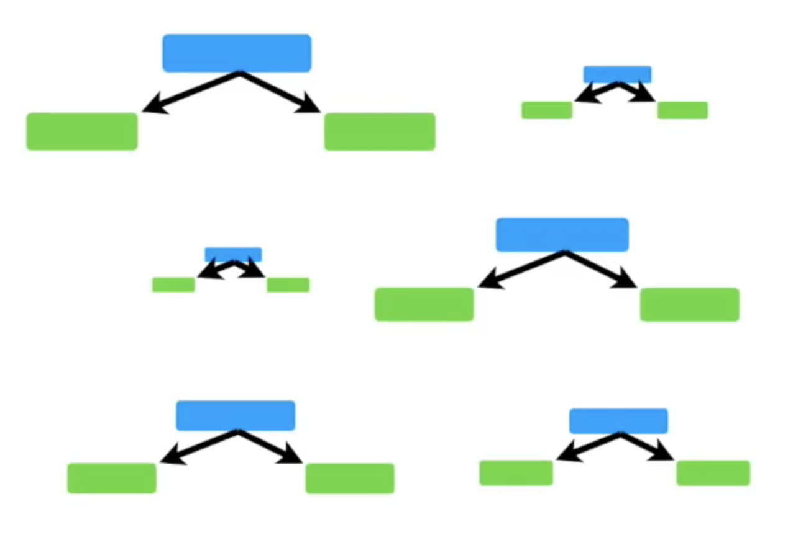
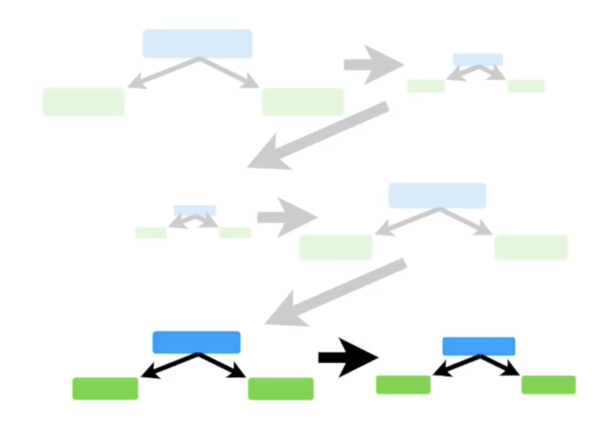
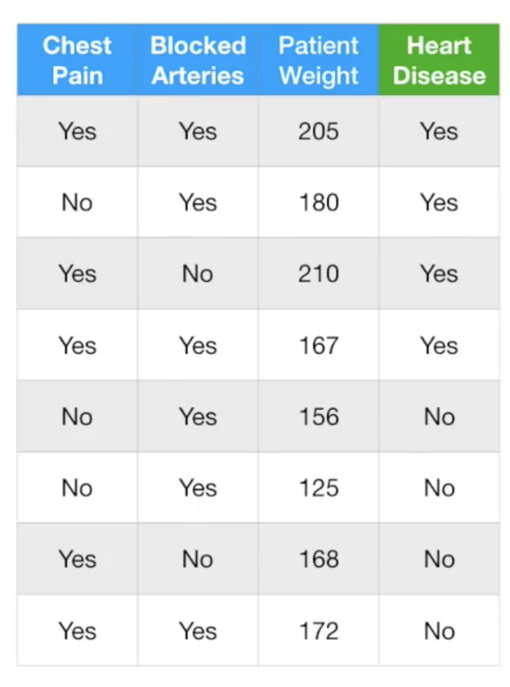
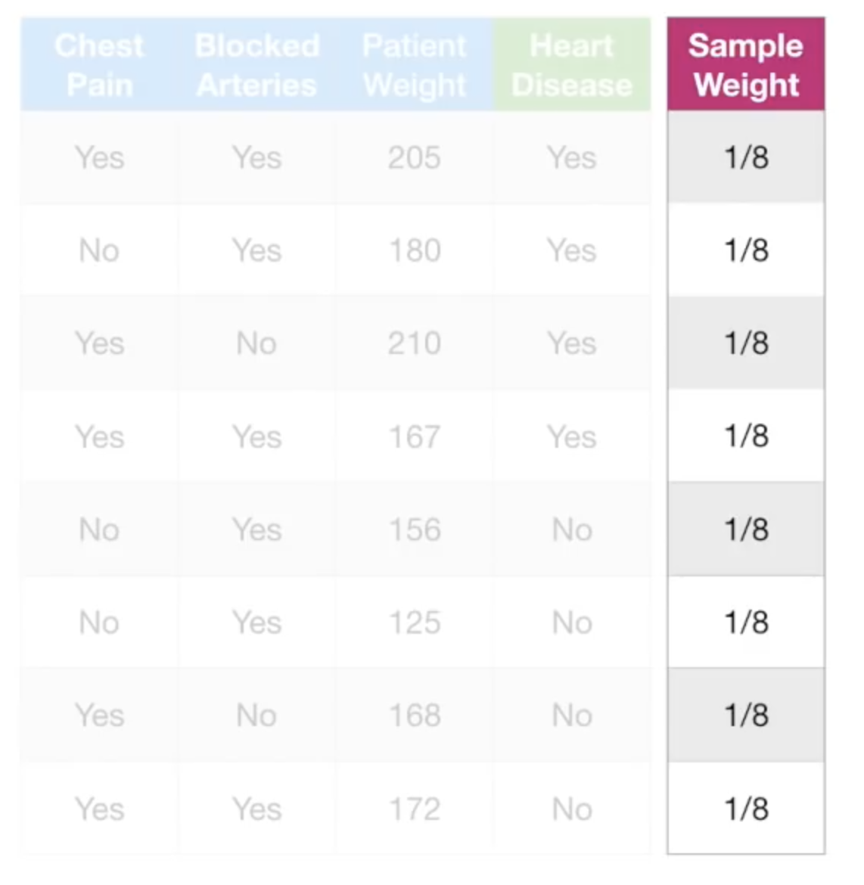
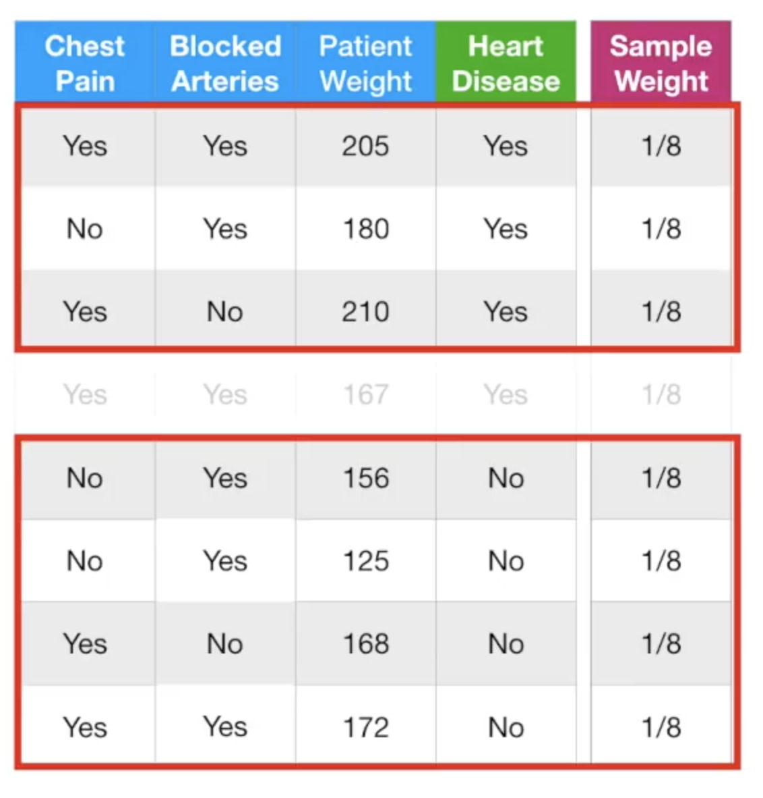
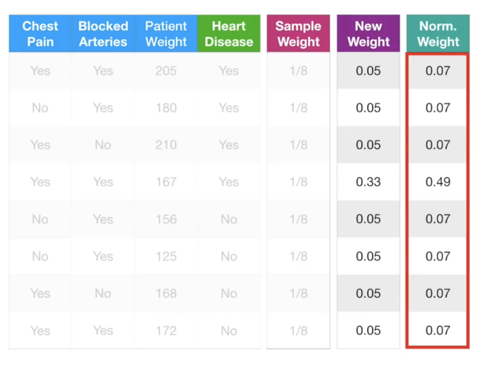

# 提升方法

- 有监督学习
- 分类问题

# 什么是提升方法？

相信大家都听过，“三个臭皮匠顶个诸葛亮”，提升方法基于这种思想，将多个专家的判断进行适当的综合，得出的结论比其中任何一个专家单独的判断要好。

首先，我们先来了解一个概念：

“强可学习”  $(strongly\space learnable)$ 和 “弱可学习” $(weakly\space learnable)$

$PAC(probably\space approximately\space correct)$，在概率近似正确$(PAC)$的学习框架中，一个概念(一个类)，如果存在一个多项式的学习算法能够学习它，并且正确率很高，那么我们称这个概念是强可学习的；如果存在一个多项式的学习算法能够学习它，但是正确率只比随机猜略高，那么我们称这个概念是弱可学习。

提升方法$(AdaBoost)$主要用于弱可学习，通过反复学习，得到一系列的弱分类器(又称为基本分类器)，然后组合这些弱分类器，构成一个强分类器。

在分类问题中，提升方法通过改变训练样本的概率分布（训练数据的权值分布），学习多个分类器，并将这些分类器进行线性的组合，从而提升高分类的性能。

对于 $Adaboost$ 来说，有两个问题需要回答：

- 问题一，在反复学习中如何改变训练数据的权重或则概率分布？
- 问题二，若何将多个弱分类器组合成为强分类器？

对于问题一，$Adaboost$ 的做法是，在每一轮的学习中，提高那些被前一轮弱分类器错误分类样本的权值，从而降低那些被正确分类样本的权值。原因在于，那些没有得到正确分类的数据，由于其权值的加大而受到后一轮中弱分类器的更大关注。

对于问题二， $Adaboost$ 采用加权多数表决的方法。具体地，加大分类误差率小的弱分类器的权值，使其在投票表决中起较大的作用；减小分类误差率大的弱分类器的权值，使其在表决中起较小的作用。

# 通过提升决策树的例子来理解$Adaboost$ ~

##### 预备知识：

- 通常以下树型结构被称为树桩（$stumps$）即弱分类器

  

- 每个分类器的权重是不相同的，如下图所示，越大的树桩表明此弱分类的决策作用更大

- 弱分类器的顺序十分重要，每个弱分类器会考虑前一个分类器的错误

#### 观察下表的数据：

#### $Step1$：计算基尼系数

首先，我们会对每组数据进行权重 ($sample\space weight $) 的初始化，即每组数据的初始权重为 $sample\space weight=\frac{1}{\sum_{i=1}^{n}}$：

接下来，我们计算 $Chest\space pain,Blocked\space Arteries,Patient\space weight$ 的基尼系数

可以由图观察得出，$Patient\space weight$ 的基尼系数最低，因此我们选择它作为**第一个弱分类器**，

#### $Step2$：计算分类器的权值并更新样本的权值

接下来我们基于此分离器的错误率 ($Total\space Error$) 计算此分类器的权值 ($vote\space weight$) ：
$$
vote\space weight = \frac{1}{2}log(\frac{1-Total\space Eror}{Total\space Eror})
$$
观察 $vote\space weight$ 随 $Total\space Error$ 的趋势变化图，理解一下此公式的含义～

- 当 $Total\space Error$ 接近 $0$ 时，权值接近正无穷
- 当 $Total\space Error$ 接近 $0.5$ 时，权值接近 $0$
- 当 $Total\space Error$ 接近 $1$ 时，权值接近负无穷

在本例中，$vote\space weight = \frac{1}{2}log(7) = 0.97$

第一个弱分类器的错误分类样本如图所示，我们需要对错误分类的样本更新权值 ($sample\space weight$)：

更新公式如下：
$$
New\space Sample \space Weight =  sample \space weight \times e^{vote\space weight}
$$
同样，我们观察  $e^{vote\space weight}$ 的趋势变化图，如图所示：

- 当分类器的权值相对较小时，说明上一个分类器效果较差，错误分类的新的样本的权值相对减小
- 当分类器的权值相对较大时，说明上一个分类器效果良好，错误分类的新的样本的权值相对增大

在本例中，$New\space Sample \space Weight =\frac{1}{8} \times e^{0.97}=0.33$，即更新错误分类的样本的权值为 $0.33$

更新完错误分类样本的权值后，我们也需要更新正确分类样本的权值，公式如下：
$$
New\space Sample \space Weight =  sample \space weight \times e^{-vote\space weight}
$$

同样，我们观察 $e^{-vote\space weight}$ 的趋势变化图，如图所示：

- 当分类器的权值相对较小时，说明上一个分类器效果较差，正确分类的新的样本的权值相对增大
- 当分类器的权值相对较大时，说明上一个分类器效果良好，正确分类的新的样本的权值相对减小

在本例中，$New\space Sample \space Weight =\frac{1}{8} \times e^{-0.97}=0.05$!

最后，我们根据第一个分类器，更新错误分类样本以及正确分类样本的权值，并做归一化处理～，得到如下图所示：

#### $Step3$：重复上述过程

#### $Step4$：使用典型的随机森林树做出最终决定

